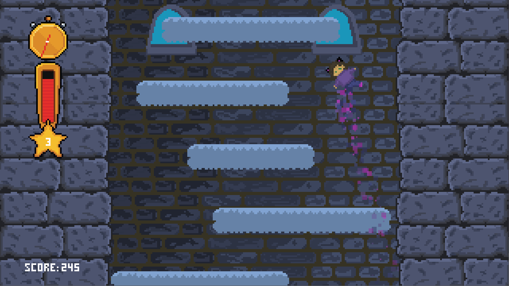

# Icy Tower
> Remake of Icy Tower implemented in Python using the Pygame library.
## Table of Contents
* [General Information](#general-information)
* [Project Features](#project-feature)
* [Game Graphics](#game-graphics)
* [Running the Game](#running-the-game)
* [Creators](#creators)

## General Information
- Recreation of the 2001 game Icy Tower using Python and Pygame
- Adapting the game to current hardware standards

## Project Features
- Mechanics based on the original 2001 Icy Tower
- Pixel art graphic style
- Original soundtrack
- Game resolution and refresh rate adjusted to 2023 standards

## Game Graphics

## Running the Game
To run the game, you need a Python interpreter (version 3.10 or higher) and the Pygame module (at least version 2.1).

To start the game, run the main.py file using the Python interpreter.

## Creators
- Marcin Banak
- Karol Burczyk
- Julia Cygan
- Katarzyna Jodłowska
- Bartosz Kruszewski
- Miłosz Krzysiek
- Maciej Szałasz
